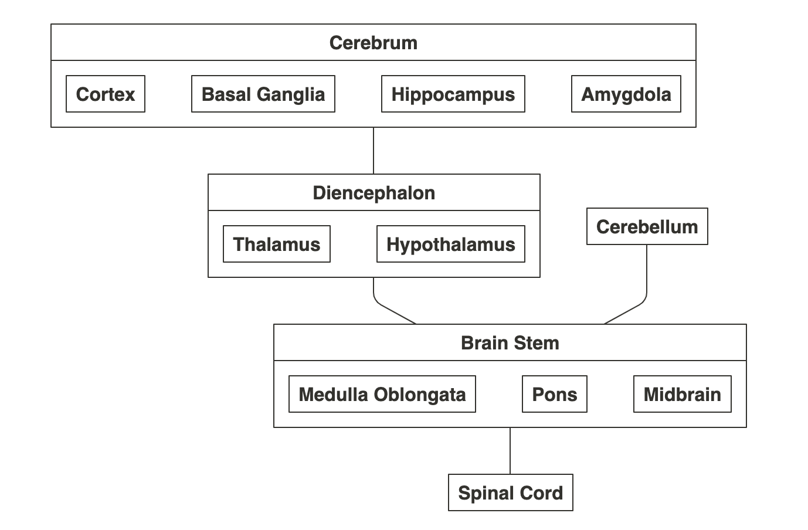
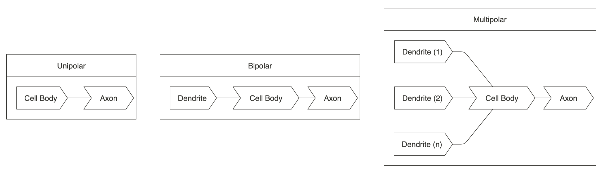

= Brain

// In this chapter...

== Overview

The human brain is a network of more than 100 billion individual cells interconnected in neural circuits that construct our perception of the extenal world, fix our attention, and control the machinery of our actions.

The specificity of the synaptic connections established during development underlie perception, action, emotion, and learning. Genes contribute to behavior, but behavior itself is not inherited. Genes encode proteins that are important for the development and regulation of the neural circuits that underlie behavior. The environment becomes of prime importance after birth, and environmental contingencies can influence behavior by altering _gene_ expression.

- The brain processes simple to complex bahaviors.
- The cortex highly developed in humans, organized in functional areas and made of large groups of neurons.
- In the 1800, Golgi and Ramon y Cajal, indetify the mains parts of the neuron: The cell body, Axon and dentrites. Together developed key concepts of the _Neuron Doctrince_ the principle that "Individual neurons are the building blocks of the nervous system". They champtioned the view of _cellular connectionism_, individual neurons are the signaling units of the brain, they are arranged in functional groups and connect to one another in a precise fashion.

== Components

The _central nervous system_ is the part of the nervous system consisting of the brain and spinal cord; with the exception of the spinal cord, these are the components of the brain:

Spinal Cord::
The _spinal cord_ receives and processes sensory information and controls movement.

Brain Steam::
The _brain steam_ controls arousal and awareness levels, it's composed of the medulla oblongata, pons and midbrain. The _medulla oblongata_ controls for _autonomic_ (read automatic) functions like digestion, breathing and controlling the heart rate. The _pons_ convey movement information from the cerebral hemispheres to the cerebellum. The _midbrain_ controls sensory and motor functions like eye movement and visual and auditory reflexes.

Cerebellum::
The _cerebullum_ modulates the force and range of movement and learns motor skills.

Diencephalon::
The _diencephalon_ contains the thalamus and hypothalamus, which regulates autonomic, endocrine and visceral functions. 

Cerebrum::
The _cerebrum_ comprised of cerebral cortex, the basal ganglia, hippocampus and amygdala. Cognitive abilities accur primarly in the _cerebral cortex_. The _basal ganglia_ regulates motor performance, the _hippocampus_ memory, and _amygdala_ emotional states.

////
#fill: #FFF
#lineWidth: 1
[Cerebrum|
  [Cortex]
  [Basal Ganglia]
  [Hippocampus]
  [Amygdala]
]-[Diencephalon]
[Diencephalon|
  [Thalamus]
  [Hypothalamus]]-[Brain Stem]
[Cerebellum]-[Brain Stem]
[Brain Stem|
  [Medulla Oblongata]
  [Pons]
  [Midbrain]
]-[Spinal Cord]
////

== Cortex

Operations responsible for our cognitive abilities occur primarly in the cerebral cortex. It comprises two hemispheres and is divided into four distinct lobes: frontal, parietal, occipital and temporal. The _frontal lobel_ relates to memory, planing and movement, _parietal_ in body image and extrapersonal space, _occipital_ vision, and _temporal_ herating, learning, momory and emotion. Each hemisphere is concerned with sensory and motor processes in the opposite side of the body. The hemispheres are neither completely symmetrical in structure nor equivalent in function.

// Consider adding anatomical diagram showing cortext as a sheet of paper

Paul Broca first to identify specific areas of the brain concerned with language. In 1864 announced "We speak with the left hemisphere". Wernicke proposed the functional areas in the brain only map to the most basic mental functions, but the components of a single behavior are likely to be processed in several regions of the brain -- _distributed processing_ is now a central tenet of neuroscience. For instance, the _angular gyrus_ processes the initial steps in spoken or written words by associating information for visual and auditory regions. Spoken or written words are transformed into a neural code shared by both speech and writting.

Lashley later proposes that cortex subdivisions are meaningless, since with minor brain lesions, the brain is still able to learn. However, around the 1930s, localization of function became overwhelming -- Specialization is a key organizing principle, but it's an emergent property.

For example, Hirsh found out that when adults learn a second language, each language localizes in distinct regions of the brain within _Broca's area_; but when learnt eaerly in life, both are localized in the same region. However, _Wernicke's area_ retains similar structure even in the presence of multiple languages since evidence exists this area processes grammatical rules. Similarily, other areas exist in the visual system focused with where an object is located, what that object is, and so on.

Wernicke's area is also related to comprehension of emotion in speech, Broka's in expressing the emotional aspects of speech.

It is now believed that many cognitive abilities are the result from interactions across several regions. This mental process consists of parallel paths that ultimately converge to a set of cells; otherwise, the brain would function as independent units competing against each other which can happenin some circumstances. For instance, each hemisphere is self-aware but converge in the _corpus callosum_. Gazzaniga found out that when the corpus callosum is damaged, the affected individual would put on clothers with their left hand while putting them off with the right one.

== Neurons

Sensory receptors are connected to the brain, which selects important events from the sensors and organizes perception.

There are two clases of cells in the brain, neurons and glial cells. Neurons are the basic unit of the brain and there are about 100 billion of them. Neurons produce different actions by the way they are interconnected, which is a key organizational principle of the brain.

A typical neuron has four regions: The dendrites, cell body, axon and presynaptic terminals.

////
#fill: #FFF
#lineWidth: 1
#direction: right
#spacing: 50
#padding: 16
#.trans: visual=transceiver
[<trans>Dendrites]-[<trans>Cell Body]
[Cell Body]-[<trans>Axon]
[<trans>Axon]-[<trans>Presynaptic Terminals]
////

Dendrite::
A _dendrite_, from the Greek déndron meaning "tree", is a tree-like structure which usually receive signals from other nerve cells. 

Cell Body::
The _cell body_ or _soma_, contains the _nucleus_, which contains the genes of the cell and a mechanism to synthetize the cell's proteins. It usually gives rise to several short _dendrites_ and one long _axon_.

Axon::
The axon carries electric signals, called _action potentials_, to other neurons over distances as far as two meters. Action potentials propagate without failure or distortion at speeds of up to 100 m/s. The amplitude remains constant at 100 mV because the action potential is an all-or-nothing impulse. Action potentials are the signals by which the brain receives, analyzes, and conveys information. The signals that convey information about  vision or smell are identical. Therefore, information is determined by the pathway the signals travels through, which in turn create our sensations of sight, touch, smell and sound. To increase the action potentials speed, axons are wrapped in _myelin_ and interrupted at regular intervals by the _nodes of ranvier_ where the action potential is regenerated.

Presynaptic Terminals::
Near the end of the axon, it branches to contact other neurons in specialized zones, known as _synapses_. The cell transmitting the signal is refered as the _presynaptic cell_ and the receiver, the _postsynaptic terminals_. Signals are transmitted from the _presynaptic terminals_, which are separated by a narrow space known as the _synaptic cleft_, and most end on a postsynaptic neuron dendrite. However, terminals can also activate muscles in motor neurons or an endocrine process through _neuroendocrine cells_.

Ramon y Cajal also defined that signals flow in one diretion, from dendrites to axons, this principle is refered as _dynamic polarization_. Ramon y Cajal also defined that neurons make specific connections -- neurons are not randomly connected to one another, known as the _connectional specificity_ principle.

=== Clasification

The feature that most distinguishes a neuron are the number of dendrites that arise from the cell body. They are classified into three main groups: _unipolar cells_ have no dendrites, _bipolar cells_ a single deendrite and _multipolar cells_ multiple dendrites.

Neurons can be broken down to six subgroups:

Unipolar::
They can be found in the autonomic nervous system. Typically these have special structures for transducing some type of physical stimulus (light, sound, temperature, etc.) into electrical activity.footnote:["Unipolar Neuron Wikipedia." https://en.wikipedia.org/wiki/Unipolar_neuron]

Bipolar::
They receive signals from the periphery of the body and carry information to the central nervous system, these include retina and olphatory sensory receptors. They have one axon and one dendrite.

Pseudo-unipolar::
These are bipolar cells that started out as unipolar cells but fused into a single single structure that resembles a bipolar cell. They convey touch, pressure, and pain signals to the spinal cord.

Motor::
_Motor neurons_ have many dendrites that create about 10,000 synapses, about 1,000 on the cell body and 9,000 on dendrites. Some can be found connecting to muscle fibers.

Pyramidal::
_Pyramidal cells_ are found in the hippocampus and cerebral cortex, there are enough dendrites to create about 32,000 synapses.footnote:[Megiaas M, EMRI Z, Freund T, Gulyaa A (2001) "Total number and distribution of inhibitory and excitatory synapses on hippocampal CA1 pyramidal cells" _Neuroscience_]

Purkinje::
_Purkinje cells_ are found in the cerebellum and have a rich and extensive dendrites that can accomodate up to a million synapses.

// Consider diagram showing neuron subgroup

== Glia

Glia cells can be divided into microglia and macroglia. Microglia are immune cells and macroglia form about 80% of the brain and subdivide into _oligodendrocytes_, _swann_ and _astrocytes_ cells. Half of macroglia is comprised of oligodendrocytes and half of astrocytes cells. Oligodendrocytes and swann cells insulate the axons while the astrocytes:

- Insulate neuronal groups.
- Regulate K+ concentration.
- Promote efficient signaling betweet neurons.
- Release growth fators.
- They may regualte synapse development and function.

== Synapses

Action potentials usually lead to excitatory synapses; however, there are also neurons with inhibition mechanisms to prevent other neurons from firing their action potential using a combination of K+ and Na+. Action potentials are all-or-nothing, there is no decay in the axon and travel at 100 m/s. In 1920, Adrian finds out that action potentials are indistinguishable even between sensors and motor axons.

There is a class of neurons, _beating neurons_, which produce an action potential in the absents of stimulation at regular intervals. Other neurons, _bursting neurons_, fire in brief bursts of action potentials. These neurons respond differently to the same exhitatory input by initiating action potentials or regulating the rate of firing action potentials.

Action potentials release _neurotransmitters_ in the neuron terminals, which bind to receptors in the postsynaptic neuron to generate a synaptic potentials. The synaptic potential can be exhitatory or inhibitory depending on the receptor and independent to the neurotransmitter being used.

Synapses can have short-term physiological changes lasting for hours to increase the synaptic effectiveness, long-term changes lasting days can happen by prunning existing synapses or growing new ones -- known as the _plasticity hypothesis_, which forms the basis for learning.

== Neural Networks

The branch of computer science known as _artificial intelligence_, originally used traditional algoritmic processing to simulate the brain.footnote:[Terminology differs with neuroscience which refers to traditional algoritmic processing as serial processing] This approach served well for some tasks, like playing chess; but performed poorly in other tasks, like face and speech recognition.

Theoretical neurologists have turned to create models they call _neural networks_, which process information using feed-forward and feedback connections. Neural networks capture well the architecture of most actual neural circuits and also the ability of the brain to function in the absence of specific sensory input such as during sleep. Neural networks also show that analyzing individual neurons may not be enough to understand an action potential. This makes the brain a remarkable information processing organ is not the complexity of the neurons but in the interconnections between its elements.

== Genes

All behaviors are shaped by the interplay of genes and the environment, but they do not control behavior directly; instead, they specify the development of programs that assemble in the brain. In 1883, galton built a strong case for gene heritability by studing identical twins; however, heritability is behavioral traits is substantially less than 100%, demonstrating that the environment is an important factor -- behavioral traits from twin studies range around 50%, but can be lower or higher for particular traits.

Genes are madee of _DNA_ passed between generations and is made of two strands to ensure accurate copying of DNA during replication. Each strand is made of four nucleotides: _adenine_, _guanine_, _thymine_, and _cytosine_.

Most genes encode protein products. The brain expressese a greated number of genees than any other organ in the body and, within the brain, different neuron populations express different groups of genes. This permits a fixede numbeere of genees to generate a vastyly largeer number of neuronal cell types and connections in the brain.

Although genes express the initial development of the nervous system, the experience of an individual and activity in specific neural circuits can alter the expression of genes.

=== Structure

// What is a gene and a chromosome? Consider diagram?

Each gene is located at a characteristic position (_locus_) on a specific _chromosome_, long linear stretches of DNA. Most animals are _diplod_, meaning every somatic cell carries two complete set of _chromosomes_, one from the mother and one from the father.

It is important to distinguish between the _genotype_ of an organism (its genetic makeup) and the _phenotype_ (its appearance). Two copies of a particular gene are called alleles. For instance, a gene affecting eye color called _OCA2_ has alleles that encode shades of blue, green, hazel, or brown. The genotype is the particular alleles (which should predict someones eye color); by contrast, the phenotype is the result of expressing this gene in a particular environment (someone's actual eye color).

A gene consists of coding regions (_exons_) separated by noncoding regions (_introns_). Transcription is regulated by noncoding regions such as promoters and enhancers. Transcription leads to producing single stranded RNA. Splicing removes introns and ligates exons into a mature messenger RNA (mRNA) which is exported from the nucleaus of the cell. The manutre mRNA is translated into a protein product.

In 2000, the complete nucleotide sequence of the human genome was reported as well as sequencees from other animals. The surprising result, humans and chimpanzees share 99% of their protein-coding genes, most of the 25,000 genes are present in all mammals, yet they are profoundly different. The conclusion, genes that humans share are regulated in new ways to produce novel human properties, like capacity to generate complex thoughts and language. Therefore, we can infer that the basic molecular pathways for neuronal development, neurotransmission, and gene expression were present in the common ancestor of worms, flies, mice and humans. Studies of animal and human genes have demonstrateed that important genes in the human brain are those most conserved throught animal phylogeny -- the role of genes can be studied in animals models.

=== Circadian Rhythm

The daily _circadian rhythm_ influences behavior, movement, visual perception, and memory. It couples certain behaviors to a 24-hour cycle linkeed to the rising and setting of the sun and it persists even in the absence of light.

Benzer's group found out that a gene mutation in the _period gene_ could change the circadian clock in several ways, resulting in abnormal rhythms -- it's not just an essential piece, but the actual timekeeper whose activity can change the rate at which the clock runs. Previous to this discovery of the preiod gene, many questioned whether there could be true "behavior genes".

The period gene is a transcriptional regulator that affects the expression of other genes with its levels regulated throughout the day, early in the morning they are low and they reach pick levels at night, levels then decrese falling before the next dawn.

Takashi found a similar, _clock gene_, which regulates the length and persistence of rhythmicity in the absence of sensory input. Therefore, a group of genes, not one gene, are the regulators of the circadian clock. One is high during night, the other one during the day; they are both transcription factors that affect each other. These genes also control the transcription of other genes; for instance, the _neuropeptide gene_ which controls locomotor activity levels. The oscillation of them can be reset by light.

== Behavior

Sokolowski found out a _forager gene_ in larvae and honeybees which encodes the _kinase protein_ which regulates many neuronal functions, specially those that transform short-term neural signals into long-term changes in a neuron. High levels of this gene are expressed in foraging behavior, low levels in stationary behavior. Crowded envrionemnts favors foraging behavior, whereas sparse environments favor stationary behavior to exploit food sources more thoroughly.

Social behaviors are highly variable beetween species, yet they have a large innate component controlled genetically. In worms, the _npr1 gene_ encodes a neuropeptide receptor, is involved in signaling between neurons. Neuropeptides have a role in coordinating behaviors across networks of neurons. Mammalian neuropeptides have been implicated in feeding behavior, sleep, pain, and other behavior and psycological processes. For instance, the neuropeptides _oxytocin_ and _vasopressin_. Oxytocin has been found to regulate pair-bonding formation and paternal behavior, while vasopressin has been show to regulate how closely male rodents help raise offpring.

In humans, defects in speech articulation led to the identification of the _foxp2 gene_, which controls a human-specific pattern of development of the brain, larynx and mouth. This gene might be one of the adaptations that made human speech possible.

The _neuregulin gene_ affects cell migration and synapse formation, together with the _disc1 gene_ suggest a developmental defect that can underlie schizophrenia. Several gene mutations in autistic patients affect transmembrane signaling proteins called _neurexins_ and _neuroligins_, which affect the strength of synapses. They suggest that subtle alterations in synaptic transmission play a role in autism. However, only rarely will genetic alteration at a single gene fully explains a disease or behavior in humans. Instead, the interplay of genetics, environment, chance and individual choice is what ultimately determines the behavioral differences between individuals. The challenge of genetics is to underestand the effeect of genes, while acknowledging that many factors influence human behavior.

== Recap

You learned some of the neuroscience principles: neurons are the building blocks (neuron doctrine), they are arranged in functional groups (cellular connectionism), process behavior in multiple regions (distributed processing), produce different actions by the way the are connected (organizational principle), signals flow in one direction (dynamic polarization), neurons are not randomly connected (connectional specificity), and that connectivity changes are the basis for learning (plasticity hypothesis).

